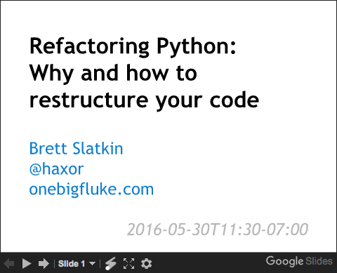

# Refactoring Python: Why and how to restructure your code

From the PyCon 2016 talk in Portland, OR ([offical schedule link](https://us.pycon.org/2016/schedule/presentation/2073/)).

Slides are here (click image below to view):

## Example code

Here are full Jupyter notebooks for each of the examples in the slides:

- [Example 1: Extract Variable](Extract Variable.ipynb)
- [Example 2: Extract Method](Extract Method.ipynb)
- [Example 3: Extract Class](Extract Class.ipynb)

To run the example code (must have Python3 installed):

1. Download this repo
2. Go into the repo directory on your local machine
2. `pyvenv .`
3. `source bin/activate`
4. `pip3 install -r requirements.txt`
5. `jupyter notebook`
6. Control-C to kill the notebook when you're done
7. `deactivate` to leave the Python environment

## License

The code within is [released under the Apache 2.0 License](LICENSE).
